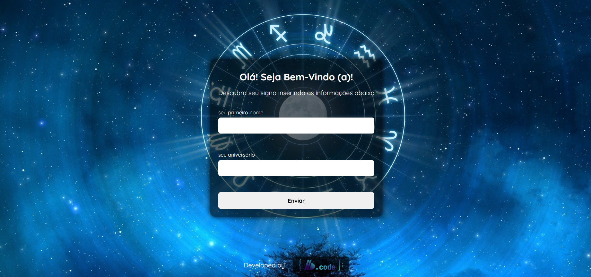

# ⏱️ What's Your Sign ?



## Sobre o Projeto:

Este projeto é um "detector de signos" que exibe o signo do usuário com base na data de nascimento. Ele inclui os seguintes recursos:

- Exibe mensagens de erro se os campos não forem preenchidos corretamente.
- Mostra um popup quando todos os campos são preenchidos corretamente.
- No popup, são exibidos o nome do usuário, o nome do signo correspondente e uma imagem que representa o signo.

## 📌 Começando

Para ter acesso a esse projeto, faça os seguintes passos:

### **1. Pré-requisitos:**

- **IDE:** Garanta que tenha uma IDE instalada na sua máquina (por exemplo, Visual Studio Code).

- **Extensão para Servidor Local:** Instale uma extensão na sua IDE que permita iniciar um servidor local para visualizar o projeto (como Live Server).

- **Node.js e npm:** Certifique-se de que o Node.js e o npm estão instalados na sua máquina.

### **2. Instalando:**

Clone o repositório em sua máquina local:

```bash
git clone https://github.com/code-front-braga/PR-Whats_Your_Sign.git
```

#### **1. Instalando as dependências:**

Para instalar as dependências de desenvolvimento, faça o seguinte comando:

```bash
npm i
```

### **3. Executando o projeto:**

#### **1. Compilar TypeScript:**

Para compilar os arquivos TypeScript para JavaScript, execute o seguinte comando:

```bash
npm run build
```

#### **2. Iniciar Servidor Local:**

Se você estiver usando uma extensão como o Live Server no Visual Studio Code, você pode iniciar o servidor diretamente pela interface da IDE. Alternativamente, use o comando:

```bash
npx live-server
```

Isso abrirá o projeto no seu navegador padrão. Ou se quiser ver somente o funcional, eu hospedei o projeto no GitHub Pages: [What's Your Sign](https://code-front-braga.github.io/PR-Whats_Your_Sign/)

## 🧑🏻‍💻Tecnologias utilizadas:

<div style="flex-basis: 48%;">


  
</div>
<br>
<br>

## 🔄️ Melhorias Futuras:

Planejo adicionar as seguintes funcionalidades:

- Calendário: Implementar um calendário que mostra as datas de início e término de cada signo.
- Informações Detalhadas: Adicionar descrições detalhadas sobre a personalidade, características e traços de cada signo.

## 📝 Licença:

Este projeto está licenciado sob a licença MIT.
<br>
<br>

## 🧑🏻‍💻 Autor:

<a href="https://github.com/code-front-braga" style="text-align: justify;">

</a>
